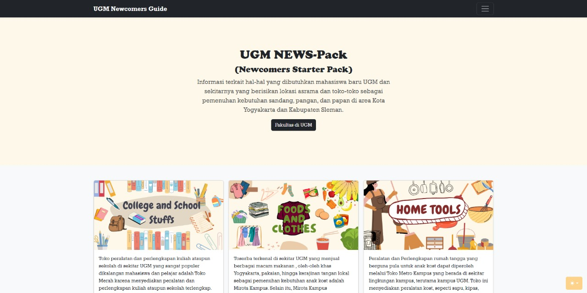
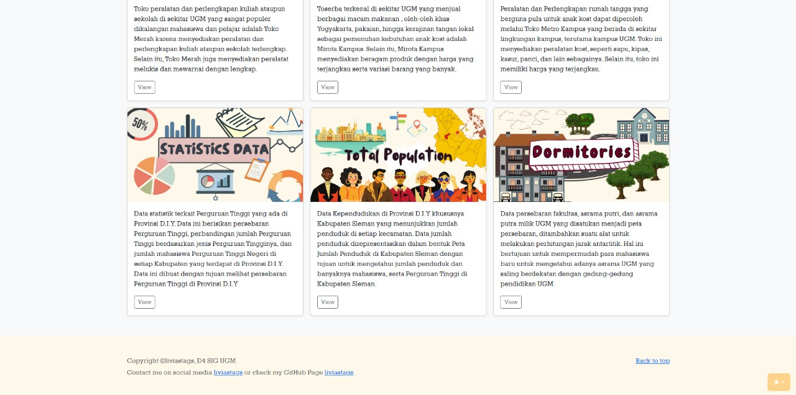

  

<h1>📌 NAMA PRODUK</h1>  

<strong>UGM NEWS-Pack (UGM Newcomer Starter Pack)</strong>
  

  

<h1>📖 DESKRIPSI PRODUK</h1>  

  
<strong>UGM NEWS-Pack</strong> adalah aplikasi WebGIS yang dirancang untuk membantu mahasiswa baru Universitas Gadjah Mada (UGM) dalam mempersiapkan kehidupan mereka di lingkungan baru.  
Aplikasi ini memberikan informasi penting, termasuk:  
<ul>  
  <li>🍴 <strong>Kebutuhan pokok:</strong> toko makanan, pakaian, dan kebutuhan harian</li>  
  <li>🏢 <strong>Lokasi fakultas UGM:</strong> untuk membantu orientasi kampus</li>  
  <li>🏠 <strong>Asrama UGM:</strong> informasi fasilitas asrama yang tersedia</li>  
  <li>📊 <strong>Data statistik:</strong> jumlah perguruan tinggi di Provinsi D.I.Y dan data jumlah penduduk Kabupaten Sleman</li>  
</ul>  
Data tambahan seperti statistik populasi Kabupaten Sleman, yang memiliki jumlah penduduk tertinggi di Provinsi D.I.Y, memberikan konteks penting bagi mahasiswa baru.  

  

  

<h1>⚙️ KOMPONEN PEMBANGUN PRODUK</h1>  

Aplikasi ini dibangun menggunakan teknologi modern berikut:
  
<ul>  
  <li>🌐 <strong>Frontend:</strong>  
    <ul>  
      <li>HTML5: Struktur dasar halaman</li>  
      <li>CSS3: Styling dan layout responsif</li>  
      <li>Bootstrap: Framework untuk desain antarmuka responsif</li>  
      <li>Leaflet.JS: Library peta interaktif</li>  
      <li>Apexcharts: Visualisasi data statistik interaktif</li>  
    </ul>  
  </li>  
  <li>⚙️ <strong>Backend:</strong>  
    <ul>  
      <li>PHP: Bahasa server-side untuk pengelolaan logika</li>  
    </ul>  
  </li>  
  <li>🗄️ <strong>Database:</strong>  
    <ul>  
      <li>PhpMyAdmin: Pengelolaan basis data berbasis MySQL</li>  
    </ul>  
  </li>  
  <li>🌍 <strong>GIS Tools:</strong>  
    <ul>  
      <li>GeoServer: Untuk menyajikan data spasial</li>  
    </ul>  
  </li>  
</ul>  

  

<h1>🌐 SUMBER DATA</h1>  

Data yang digunakan dalam aplikasi ini berasal dari sumber berikut:
  
<ul>  
  <li>📊 <a href="https://yogyakarta.bps.go.id/" target="_blank">BPS Provinsi D.I.Y</a>: Data statistik</li>  
  <li>📍 <a href="https://www.google.com/maps/@-7.7651543,110.3666396,15z?entry=ttu" target="_blank">Google Maps</a>: Titik koordinat dan jumlah penduduk</li>  
  <li>🗺️ <a href="https://tanahair.indonesia.go.id/portal-web" target="_blank">InaGeoportal</a>: Data poligon Kabupaten Sleman</li>  
</ul>  

  

<h1>📸 TANGKAPAN LAYAR PENTING PRODUK</h1>  
<h2>🌟 Landing Page</h2>  

Tampilan utama aplikasi:
  
  
  
